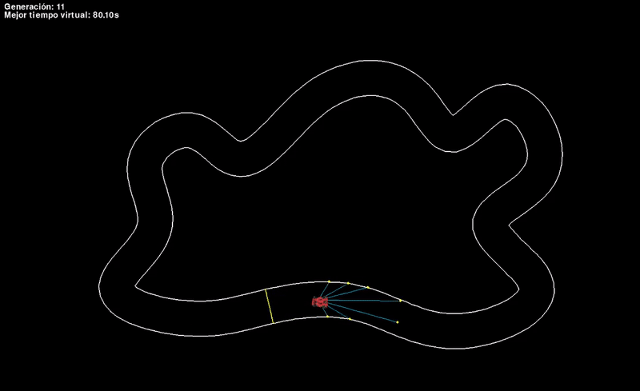

# Racing Circuit Simulation with Genetic Algorithms

This project is a reinforcement learning simulation where vehicles learn to complete a circuit using genetic algorithms. Through successive generations, the vehicles improve their performance using selection and mutation processes.

## Main Files

- **`main_torch.py`**: Implements reinforcement learning through genetic algorithms manually, using a basic neural network for decision-making.
- **`main_deap.py`**: Alternatively, implements the same process but uses the DEAP library to handle the evolutionary logic in a more structured way.

Both scripts achieve the same goal, allowing you to choose between a manual approach or a DEAP-based solution.

## Simulation Features

- **Inertial System**: A system that adjusts the turning angle based on the vehicle's speed. At higher speeds, the turning angles are reduced to mimic realistic driving behavior.
- **Friction Index and Maximum Speed**: A friction index is applied to force vehicle acceleration, and a maximum speed limit has been set to ensure consistent dynamics.
- **Boundary Elimination**: Vehicles are removed from the simulation if they touch the circuit boundaries. Also for not advancing or moving backward.

## Learning Process

Initially, vehicles are trained to reach the farthest possible distance on the circuit. As the simulation progresses, they focus on completing the circuit in the shortest time. This process allows observation of:

- **Improved Trajectory**: How vehicles refine their path through the circuit in each generation.
- **Optimal Performance**: Identifying which vehicle executes the best trajectory for completing the circuit.

## Learning Features

Through the implemented neural networks, vehicles learn to perform the following actions:
- Accelerate and brake.
- Turn in both directions.

## Configuration and Customization

The project includes parameters that can be adjusted to modify the simulation's behavior:

- **Genetic parameters**: Such as mutation rates, selection rates, and the number of generations.
- **Physical constants**: Circuit and vehicle properties, such as speed, friction, and dimensions.
- **Other parameters**: Additional factors to fine-tune the simulation dynamics.

## Objective

The evolutionary learning process selects the most successful vehicles in each generation (those that cover the most distance or complete the circuit fastest) to perform mutations and improve their performance. The ultimate goal is to optimize the vehicles' ability to efficiently complete the circuit.

## Demo

Below is a demonstration of the simulation:

## Contact

[LinkedIn](https://www.linkedin.com/in/fabianmelchor/)